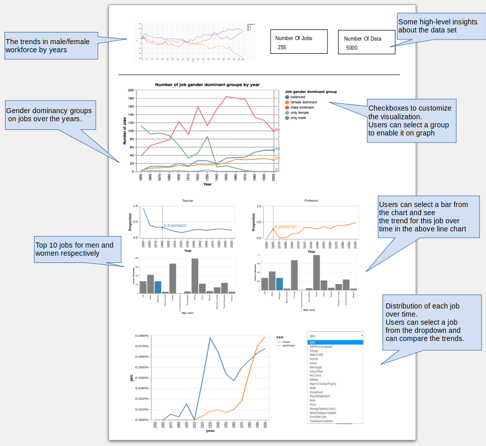

## Job Analysis Application

The `Job Analysis` app is a single-page app to provide insights about the [jobs dataset](https://github.com/vega/vega-datasets/blob/master/data/jobs.json) provided by [vega-datasets](https://github.com/vega/vega-datasets/blob/master/README.md). The dataset has information about 255 different jobs and the distribution of genders to those jobs over time. The first part of the main (landing) page shows general information about gender changes in the job market over time and some high-level information about the dataset, like the total number of observations and the unique number of jobs.

In the second part, users will be able to see the changes in gender dominancy over time. Moreover, users can enable/disable these groups by clicking checkboxes next to the graph. This functionality will allow users to compare/contrast different groups easily.

In the third part, the app will show the top 10 male and female-dominant jobs in the bar chart. By clicking on a bar, users will be able to see the changes in the proportion of female/male employees for the selected job over time. 

In the last section, users will be able to select a specific job from the dropdown menu, and the line chart next to the dropdown menu will be updated automatically. Color-codings for male and female employees will make it easier to compare employee existence over time.

Sketch below shows how the main page will look.

The `Job Analysis` app is a single-page app to provide insights about the [jobs dataset](https://github.com/vega/vega-datasets/blob/master/data/jobs.json) provided by [vega-datasets](https://github.com/vega/vega-datasets/blob/master/README.md). The dataset has information about 255 unique jobs and the distribution of genders to those jobs over time. The first part of the main (landing) page shows general information about gender changes in the job market over time and some high-level information about the dataset, like the total number of observations and the number unique jobs.

In the second part, users will be able to see the changes in gender dominancy over time. Moreover, users can enable/disable these groups by clicking checkboxes next to the graph. This will allow users to easily compare/contrast different groups.

In the third part, the app will show the top 10 male and female-dominant jobs in the bar chart. By clicking on a bar, users will be able to see the changes in the proportion of female/male employees for the selected job over time. 

In the last section, users will be able to select a specific job from the dropdown menu and the line chart next to the dropdown menu will be updated automatically. Color-codings for male and female employees will make it easier to compare employee existence over time.

Sketch below shows how the main page will look like.

